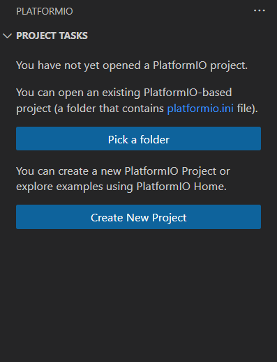

## Introduction
This tutorial is designed for anyone that is interested in learning more in using and hosting a WiFi server on the ESP32-S3 devboard and send and communicating realtime using websocket

### Learning Objectives
- Learn how to create a WiFi Server on ESP32
- Learn how to create websocket for immediate signal transfer

- Using PlatformIO (instead of Arduino) for faster development
- Host a WiFi server (access point) on ESP32
- Using Websocket to send realtime command

### Background Information

This tutorial is a summary and conclude of our group project of controlling a window cleaning bot through WiFi using phone.

## Getting Started
### Required Downloads and Installations

VSCode installed
  - Including PlatformIO IDE extension 
  - Link: https://marketplace.visualstudio.com/items?itemName=platformio.platformio-ide


### Required Components

| Component Name    | Quanitity |
| ----------------- | --------- |
| ESP32-S3 Devboard | 1         |


### Required Tools and Equipment
- Laptop/PC

## Part 01: Setting Up WiFi Server

### Introduction
In this part, you'll learn how to setup a WiFi server using only the ESP32 Devboard

### Objective

- Setup development environment using platformIO
- Setup a WiFi server and display a small webpage on your device

### Background Information

Technical skill learn
- How to setup PlatformIO project
- How to setup and run a WiFi server on the ESP32

### Components

- ESP32-S3 Devboard

### Instructional

1. Open Visual Studio Code (without opening any folder)
2. Go to PlatformIO tab




3. Click on Create New Project


4. Click on New Project
5. Enter following information
   - Name: `ESP32 Web controller`
   - Board: `Espressif ESP32-S3-DevKitC-1-N8`
   - Framework: `Arduino`
   - Location: Pick your own preferred location

6. Open `platformio.ini` file
Type in
```ini
[env:esp32-s3-devkitc-1]
platform = espressif32
board = esp32-s3-devkitc-1
framework = arduino
upload_speed = 921600
monitor_speed = 115200
upload_protocol = esptool
lib_deps =
  Links2004/WebSockets@^2.3.6
  waspinator/AccelStepper@^1.64
  bblanchon/ArduinoJson@^7.4.1

build_unflags = 
  -std=gnu++11

build_flags=
  -std=gnu++17
  -D ARDUINO_USB_CDC_ON_BOOT=1
  -D ARDUINO_USB_MODE=1
  -DFORMAT_SPIFFS_IF_FAILED=true

board_build.filesystem = spiffs
extra_scripts = upload_fs.py
```

7. Create a new file `upload_fs.py`

> This file is use for file uploading
```py
# upload_fs.py
Import("env")

def before_upload_fs(source, target, env):
    env.Execute("pio run --target uploadfs")

env.AddPreAction("upload", before_upload_fs)
env.AddPreAction("program", before_upload_fs)  # optional: handles manual programming
```

8. Create a `data` directory
9. Create a file `index.html` in the `data` directory
```html
<!DOCTYPE html>
<html lang="en">
  <head>
    <meta charset="UTF-8" />
    <meta name="viewport" content="width=device-width, initial-scale=1" />
    <title>ESP32 Controller</title>
  </head>
  <body>
    <h1>ESP32 Controller</h1>
  </body>
</html>
```

10. In `src/main.cpp`, add following code
```cpp
#include <Arduino.h>
#include <ArduinoJson.h>
#include <string>

#include <SPIFFS.h>
#include <WiFi.h>

inline constexpr const char* WIFI_SSID = "ESP32-Access-Point";
inline constexpr const char* WIFI_PASSWORD = "123456789";
WiFiServer server{80};

void setup() {
    Serial.begin(115200);

    WiFi.softAP(WIFI_SSID, WIFI_PASSWORD);
    Serial.print("Access Point IP: ");
    Serial.println(WiFi.softAPIP());

    if (!SPIFFS.begin(true)) {
        Serial.println("An Error has occurred while mounting SPIFFS");
        return;
    }

    server.begin();
}

void loop() {
  WiFiClient client = server.available();
    if (client) {
      Serial.println("New Client.");
      handleClientRequest(client);
      client.stop();
      Serial.println("Client disconnected.");
    }
}

void handleClientRequest(WiFiClient& client) {
    String request = client.readStringUntil('\r');
    client.read();

    if (request.indexOf("GET / ") >= 0) {
        File file = SPIFFS.open("/index.html", "r");
        if (!file) {
            Serial.println("Failed to open /index.html");
            client.println("HTTP/1.1 500 Internal Server Error");
            client.println("Content-type:text/plain");
            client.println("Connection: close");
            client.println();
            client.println("Failed to load index.html");
            return;
        }

        client.println("HTTP/1.1 200 OK");
        client.println("Content-type:text/html");
        client.println("Connection: close");
        client.println();

        client.write(file);

        while (file.available()) {
            client.write(file.read());
        }

        file.close();
        client.println();
    }
}
```
This create a WiFiServer that returns the index.html file whenever user request `192.168.4.1`, which is the default address for esp32 WiFi server.

11. Go to PlatformIO extension tab
12. Connect ESP32 devboard to your laptop, and change it to boot mode
13. Click on `esp32-s3-devkitc-1 > General > Upload and Monitor`
14. After uploading, go to your phone and look for the WiFi name `ESP32-Access-Point`
15. Enter the password `123456789`
16. Open any browser and put in `192.168.4.1`
17. You will be able to see the webpage

## Part 02: Setting Up Web Socket server

### Introduction
In this part, you'll learn how to setup a web socket server using only the ESP32 Devboard

### Objective

- Setup a Websocket server and display a small webpage that you can click on button and display it on the serial monitor

### Background Information

Technical skill learn
- How to run and communicate through websocket

### Components

- ESP32-S3 Devboard

### Instructional
1. Add following to `src/main.py`
```cpp
#include <WebSocketsServer.h>

WebSocketsServer webSocket{81};
void setup() {
  // ...previous code
  webSocket.begin();
  webSocket.onEvent(onWebSocketEvent);
}

void onWebSocketEvent(uint8_t num, WStype_t type, uint8_t* payload, size_t length) {
    if (type == WStype_TEXT) {
        String json = (char*)payload;

        JsonDocument doc;
        deserializeJson(doc, json);
        Serial.printf("Recieve Input: %s\n", doc["info"]);
    }
}
```

2. Change `data/index.html` to following:
```html
<!DOCTYPE html>
<html lang="en">
  <head>
    <meta charset="UTF-8" />
    <meta name="viewport" content="width=device-width, initial-scale=1" />
    <title>ESP32 Controller</title>
  </head>
  <body>
    <h1>ESP32 Controller</h1>
    <button type="button" onclick="sendButtonPress()" id="info">Hello!</button>

    <script>
      "use strict";
      class WebSocketHandler {
        constructor(renderer, statusDisplay, simulator) {
          this.socket = null; // Socket for websocket connection
          this.reconnectTimeout = null; // Timeout timer
          this.reconnectDelay = 2000;
        }

        connect() {
          if (
            this.socket &&
            (this.socket.readyState === WebSocket.OPEN ||
              this.socket.readyState === WebSocket.CONNECTING)
          ) {
            return;
          }

          this.socket = new WebSocket("ws://" + location.hostname + ":81");

          this.socket.onopen = () => {
            if (this.reconnectTimeout) {
              clearTimeout(this.reconnectTimeout);
              this.reconnectDelay = 2000;
              this.reconnectTimeout = null;
            }
          };

          this.socket.onclose = this.handleDisconnect.bind(this);
          this.socket.onerror = this.handleDisconnect.bind(this);
        }

        handleDisconnect() {
          if (!this.reconnectTimeout) {
            this.reconnectTimeout = setTimeout(() => {
              this.reconnectTimeout = null;
              this.connect();
              this.reconnectDelay = Math.min(this.reconnectDelay * 2, 30000); // cap at 30s
            }, this.reconnectDelay);
          }
        }
      }

      let wsHandler;

      function sendButtonPress() {
        if (
          wsHandler.socket &&
          wsHandler.socket.readyState === WebSocket.OPEN
        ) {
          wsHandler.socket.send(JSON.stringify({ info: "Hello!" }));
        }
      }

      window.onload = () => {
        wsHandler = new WebSocketHandler();
        wsHandler.connect();

        window.addEventListener("online", () => {
          if (
            !wsHandler.socket ||
            wsHandler.socket.readyState === WebSocket.CLOSED
          ) {
            wsHandler.connect();
          }
        });

        window.onbeforeunload = () => {
          if (
            wsHandler.socket &&
            wsHandler.socket.readyState === WebSocket.OPEN
          ) {
            wsHandler.socket.close();
          }
        };
      };
    </script>
  </body>
</html>
```
3. Go to PlatformIO extension tab
4. Connect ESP32 devboard to your laptop, and change it to boot mode
5. Click on `esp32-s3-devkitc-1 > General > Upload and Monitor`
6. After uploading, go to your phone and look for the WiFi name `ESP32-Access-Point`
7. Enter the password `123456789`
8. Open any browser and put in `192.168.4.1`
9. You will be able to see the webpage
10. After pressing the button, you will be able to see `Recieve Input: Hello!`

## Additional Resources
- [ArduinoWebSockets - Github](https://github.com/Links2004/arduinoWebSockets)
- [WiFi - Github](https://github.com/arduino-libraries/WiFi)
